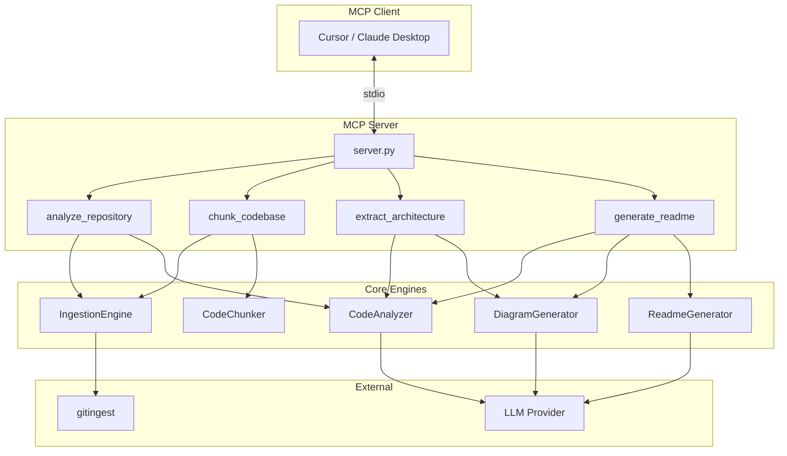

# MCP Doc Generator


An MCP (Model Context Protocol) server that analyzes GitHub repositories and local codebases to generate comprehensive documentation with Mermaid diagrams. Powered by LLM semantic analysis and [gitingest](https://github.com/coderamp-labs/gitingest) for repository ingestion.

## Features

- **🔍 Repository Analysis** - Deep semantic analysis of architecture, dependencies, patterns, and API surface
- **📊 Mermaid Diagrams** - Auto-generate flowchart, sequence, class, ER, and component diagrams
- **📝 README Generation** - Create comprehensive documentation with installation, usage, and architecture
- **🧩 Smart Chunking** - Intelligent codebase segmentation for LLM context windows
- **🔌 Multi-LLM Support** - Works with Claude, GPT-4, and local models (Ollama)
- **🌐 Universal Sources** - Analyze GitHub URLs (public/private) or local paths

## Installation

```bash
# Clone the repository
git clone https://github.com/your-username/mcp-doc-generator.git
cd mcp-doc-generator

# Create virtual environment
python -m venv .venv
.venv\Scripts\activate  # Windows
# source .venv/bin/activate  # macOS/Linux

# Install dependencies
pip install -e .
```

## Configuration

Copy `.env.example` to `.env` and configure:

```bash
cp .env.example .env
```

### Required Environment Variables

```env
# LLM Provider (anthropic, openai, or local)
LLM_PROVIDER=anthropic
ANTHROPIC_API_KEY=sk-ant-...

# For private GitHub repos
GITHUB_TOKEN=ghp_...
```

### MCP Client Setup

Add to your Claude Desktop or Cursor config:

```json
{
  "mcpServers": {
    "doc-generator": {
      "command": "python",
      "args": ["-m", "mcp_doc_generator"],
      "env": {
        "ANTHROPIC_API_KEY": "sk-ant-...",
        "GITHUB_TOKEN": "ghp_..."
      }
    }
  }
}
```

## MCP Tools

### `analyze_repository`

Analyze a repository with smart filtering and semantic understanding.

**Parameters:**
- `source` (required): GitHub URL or local path
- `analysis_depth`: `shallow` | `medium` | `deep` (default: `deep`)
- `focus_areas`: `["architecture", "dependencies", "api", "patterns"]`
- `include_patterns`: Glob patterns to include
- `exclude_patterns`: Additional exclusion patterns

**Example:**
```
Analyze https://github.com/fastapi/fastapi with deep analysis focusing on architecture and API
```

---

### `chunk_codebase`

Intelligently chunk a codebase for LLM context windows.

**Parameters:**
- `source` (required): GitHub URL or local path
- `strategy`: `file` | `directory` | `semantic` | `hybrid` (default: `hybrid`)
- `max_tokens`: Maximum tokens per chunk (default: 100,000)
- `overlap_tokens`: Context overlap between chunks (default: 500)

**Example:**
```
Chunk https://github.com/langchain-ai/langchain using semantic strategy with 50k token limit
```

---

### `extract_architecture`

Extract architectural patterns and generate Mermaid diagrams.

**Parameters:**
- `source` (required): GitHub URL or local path
- `diagram_types`: `["flowchart", "sequence", "class", "er", "state", "component"]`
- `max_nodes`: Maximum nodes per diagram (default: 50)

**Example:**
```
Extract architecture from ./my-project and generate flowchart and component diagrams
```

---

### `generate_readme`

Generate comprehensive README documentation.

**Parameters:**
- `source`: GitHub URL or local path
- `sections`: Sections to include (default: all)
- `include_diagrams`: Include Mermaid diagrams (default: true)
- `tone`: `professional` | `casual` | `technical` (default: `professional`)

**Example:**
```
Generate a professional README for https://github.com/user/repo with architecture diagrams
```

## Architecture



## Project Structure

```
mcp-doc-generator/
├── pyproject.toml
├── .env.example
├── README.md
└── src/
    └── mcp_doc_generator/
        ├── server.py           # MCP server & tool registration
        ├── __main__.py         # CLI entry point
        ├── tools/              # MCP tool implementations
        │   ├── analyze_repository.py
        │   ├── chunk_codebase.py
        │   ├── extract_architecture.py
        │   └── generate_readme.py
        ├── core/               # Core business logic
        │   ├── ingestion.py    # Gitingest wrapper
        │   ├── analyzer.py     # LLM code analysis
        │   ├── chunker.py      # Intelligent chunking
        │   ├── diagram_gen.py  # Mermaid generation
        │   └── readme_gen.py   # README generation
        ├── llm/                # LLM integration
        │   ├── client.py       # Abstract client
        │   ├── prompts.py      # Prompt templates
        │   └── providers/
        │       ├── anthropic.py
        │       ├── openai.py
        │       └── local.py    # Ollama
        └── schemas/            # Pydantic models
            ├── analysis.py
            ├── chunk.py
            ├── diagram.py
            └── readme.py
```

## Development

```bash
# Install dev dependencies
pip install -e ".[dev]"

# Run tests
pytest

# Format code
ruff format .
ruff check --fix .
```

## LLM Providers

### Anthropic Claude (Recommended)
- Best for code understanding
- 200k context window
- Structured outputs via tool use

### OpenAI GPT-4
- Alternative provider
- JSON mode for structured outputs

### Ollama (Local)
- Offline capability
- Supports DeepSeek Coder, CodeLlama

## License

MIT License - see [LICENSE](LICENSE) for details.
